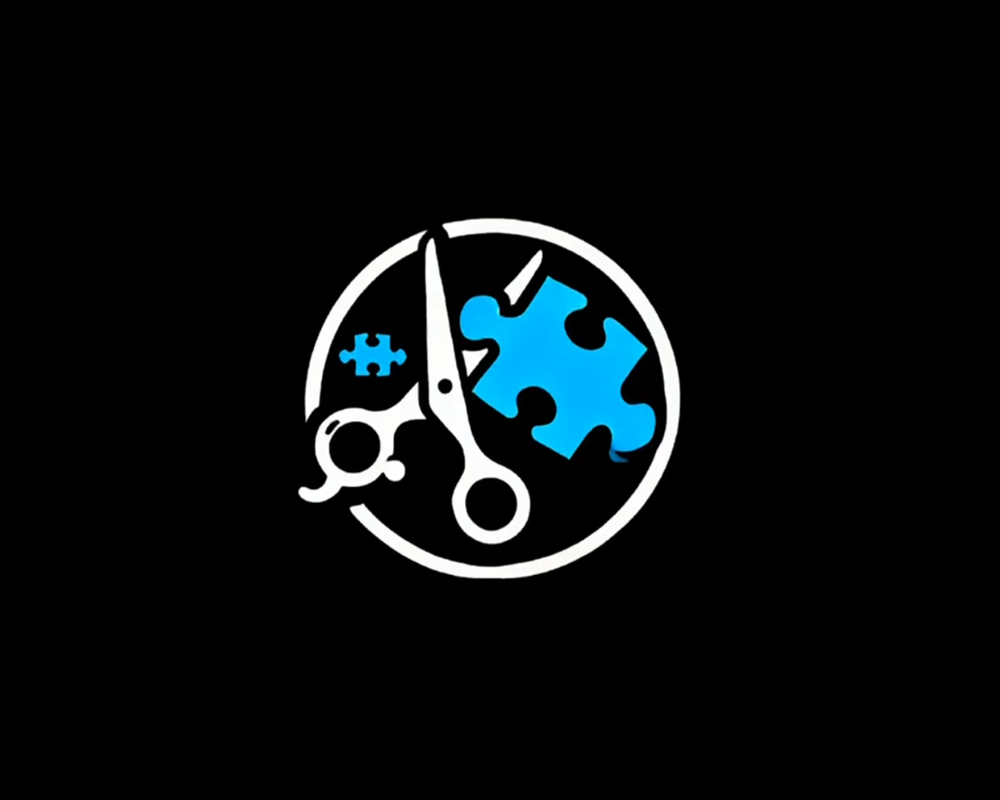

# ✂️ CorteAzulTea - Barbeiro Especializado em Crianças Autistas



##  **Sobre o Projeto**

O **CorteAzulTea** é um site profissional para o barbeiro Jonathan Rodrigues, especializado em atendimento humanizado para crianças autistas (TEA). O projeto oferece uma experiência digital completa, apresentando serviços especializados, depoimentos de famílias e informações sobre o movimento pela causa do autismo.

##  **Características Principais**

- **Atendimento Especializado TEA**: Foco em crianças autistas com técnicas adaptadas
- **Design Responsivo**: Interface moderna e acessível em todos os dispositivos
- **Galeria de Trabalhos**: Fotos e vídeos dos atendimentos realizados
- **Depoimentos**: Avaliações reais das famílias atendidas
- **Informações de Contato**: WhatsApp, Instagram e localização
- **PWA Ready**: Manifest e configurações para Progressive Web App

##  **Tecnologias Utilizadas**

- **Frontend**: HTML5, CSS3, JavaScript ES6+
- **Framework CSS**: Tailwind CSS
- **Ícones**: Font Awesome 6.5.0
- **Fontes**: Google Fonts (Inter)
- **Responsividade**: Mobile-first design
- **Animações**: CSS transitions e keyframes

### ✂ **Serviços Oferecidos**
- Atendimento na Barbearia (R$ 85)
- Atendimento a Domicílio (R$ 100)
- Corte Kids (R$ 60)

###  **Conteúdo Multimídia**
- Vídeos explicativos dos serviços
- Galeria de fotos dos atendimentos
- Podcasts e entrevistas
- Reportagens da mídia


## 🏗 **Estrutura do Projeto**

```
ProjetoCorteAzulTea/
├── index.html          # Página principal
├── style.css           # Estilos personalizados
├── script.js           # Funcionalidades JavaScript
├── manifest.json       # Configurações PWA
├── tailwind.config.js  # Configuração Tailwind
├── img/                # Imagens e vídeos
│   ├── *.jpg          # Fotos dos atendimentos
│   ├── *.mp4          # Vídeos explicativos
│   └── *.svg          # Ícones
└── README.md           # Documentação
```

##  **Design e UX**

- **Paleta de Cores**: Azul (#3b82f6) como cor principal
- **Tipografia**: Inter para melhor legibilidade
- **Animações**: Transições suaves e efeitos hover
- **Acessibilidade**: Navegação por teclado e leitores de tela
- **Performance**: Lazy loading e otimizações CSS

##  **Seções do Site**

1. **Hero**: Apresentação principal com call-to-action
2. **Sobre**: Informações sobre Jonathan e especialização
3. **Diferenciais**: O que torna o atendimento único
4. **Como Funciona**: Processo de atendimento
5. **Preços**: Tabela de serviços e valores
6. **Galeria**: Fotos dos atendimentos realizados
7. **Depoimentos**: Avaliações das famílias
8. **Contato**: Informações de localização e redes sociais

## 🔧 **Instalação e Uso**

### **Requisitos**
- Navegador moderno (Chrome, Firefox, Safari, Edge)
- Servidor web local (opcional para desenvolvimento)

### **Execução Local**
```bash
# Clone o repositório
git clone https://github.com/seu-usuario/corteazultea.git

# Entre na pasta
cd corteazultea

# Abra o index.html no navegador
# Ou use um servidor local:
python -m http.server 8000
# Acesse: http://localhost:8000
```

## 🌐 **Deploy**

## Vercel 
Efetuado no VERCEL

##  **PWA Features**

- **Manifest**: Configuração para instalação
- **Service Worker**: Cache offline (implementação futura)
- **Ícones**: Diferentes tamanhos para dispositivos
- **Tema**: Cores personalizadas para a interface

## 📄 **Licença**

Este projeto é de uso pessoal e comercial para Jonathan Rodrigues. Todos os direitos reservados.

## 👨‍💻 **Desenvolvimento**

- **Desenvolvedor**: Natan Da Luz
- **Design**: Interface moderna e responsiva
- **SEO**: Otimizado para motores de busca
- **Performance**: Carregamento rápido e eficiente

---

⭐ **Se este projeto te ajudou, deixe uma estrela no repositório!**
