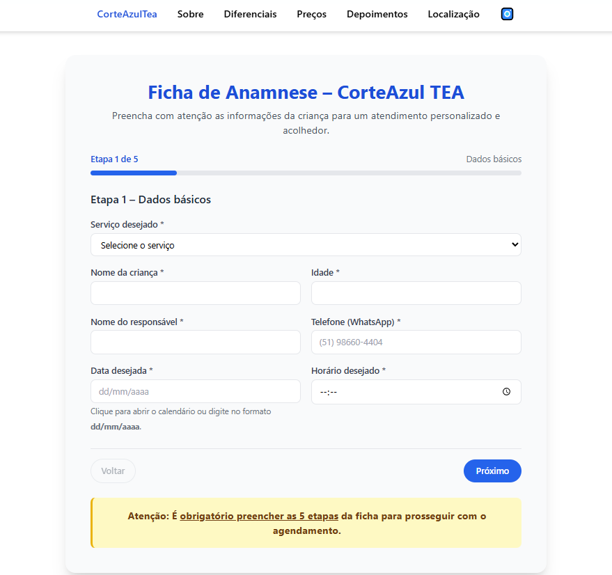

## CorteAzulTea — Website Institucional

Aplicação web estática responsiva desenvolvida para **Jonathan Rodrigues** — barbeiro especializado em atendimento infantil para crianças com Transtorno do Espectro Autista (TEA). Foco em atendimento humanizado, comunicação clara com famílias e otimização do fluxo de agendamentos.

    

---

## 📸 Screenshots do Projeto

### Home


### Serviços


### Contato


### Ficha de Anamnese (Feita Recentemente)


---

## Objetivo do Projeto

Desenvolver uma plataforma web institucional moderna e acessível para fortalecer a presença digital do barbeiro Jonathan, comunicar seus serviços com clareza e facilitar o contato com novos clientes. O projeto também teve como objetivo melhorar a gestão dos atendimentos, permitindo maior organização de horários, redução na perda de clientes e otimização do fluxo de agendamentos.

Acrescentado no projeto: ficha de anamnese integrada, facilitando o preenchimento direto no site ao invés do Google Docs.

**Benefícios principais:**
- Comunicação clara sobre atendimento especializado (TEA)
- Interface responsiva com foco em usabilidade
- Facilitação de contato direto (WhatsApp e redes sociais)
- Apresentação estruturada de serviços, políticas e localização

---

## ⚙️ Funcionalidades

### Interface & UX
- Layout responsivo (mobile-first)
- Navegação por seções com rolagem suave
- Botão flutuante para contato rápido via WhatsApp

### Conteúdo Institucional
- Seção de serviços e valores
- Políticas de atendimento detalhadas
- **Ficha de anamnese integrada** — coleta de preferências sensoriais, gatilhos e histórico
- Informações sobre formas de pagamento

### Conteúdo Dinâmico
- Depoimentos carregados dinamicamente via JavaScript
- Seção de notícias e reportagem em vídeo
- Integração com mídias externas

### Localização e Contato
- Integração com Google Maps e rotas via Waze
- Links diretos para WhatsApp e Instagram

---

## 🧰 Stack Tecnológica

- HTML5 semântico
- CSS3 + Tailwind CSS
- JavaScript (vanilla)

---

## 🏗️ Arquitetura / Estrutura

Separação entre estrutura, estilo e comportamento:

- **HTML** → estrutura semântica e conteúdo
- **CSS / Tailwind** → layout responsivo e estilização
- **JavaScript** → interatividade e carregamento dinâmico

```
ProjetoCorteAzulTea/
├─ public/
│  ├─ index.html
│  ├─ manifest.json
│  └─ assets/
│     ├─ css/
│     │  └─ style.css
│     ├─ js/
│     │  ├─ script.js
│     │  └─ depoimentos.js
│     └─ img/
├─ tailwind.config.js
└─ README.md
```

---

## 📱 Responsividade & UX

- Abordagem mobile-first com breakpoints em 360px / 768px / 1024px
- Botões com área de toque adequada e contraste legível
- Fluxo primário: apresentação → serviços → ficha de anamnese → contato
- Depoimentos e mídias carregados assíncronamente para manter performance

---

## 🔐 Segurança e Privacidade

- Site estático: sem backend público, reduz superfície de ataque
- Integrações externas restritas e controladas (Google Maps, redes sociais)
- Recomenda-se exibir aviso de privacidade e consentimento no formulário de anamnese

---

## 📊 Resultados / Impacto

- Adoção da ficha de anamnese reduziu trocas de mensagens prévias (feedback do cliente)
- Maior clareza nas políticas e serviços, facilitando conversão em contato via WhatsApp
- Site entregue para uso real com foco em operação local e atendimento humanizado

---

## 🧪 Checklist de QA

- Validar navegação entre seções (desktop e mobile)
- Testar menu responsivo e links de âncora
- Verificar botão de WhatsApp em múltiplos dispositivos
- Testar integração Google Maps e rotas (Waze)
- Reproduzir vídeos e conteúdos externos
- Validar campos obrigatórios e fluxo da ficha de anamnese

---

## 🚀 Como Executar

**Abrir diretamente:**
```bash
# Windows
start public/index.html
```

**Servir localmente (recomendado):**
```bash
# Python 3 (porta 8000)
python -m http.server --directory public 8000

# Ou com Node.js
npx http-server public -p 8000
```

Acessar: `http://localhost:8000`

---

## 👤 Autor

**Natan Da Luz**
📧 [natandaluz01@gmail.com](mailto:natandaluz01@gmail.com)
🔗 [linkedin.com/in/natan-da-luz](https://www.linkedin.com/in/natan-da-luz)

**Cliente:** Jonathan Rodrigues — barbeiro especializado em atendimento infantil com TEA

---

## 📄 Licença

Este projeto está sob a licença **MIT** — todos os direitos reservados ao Jonathan.
