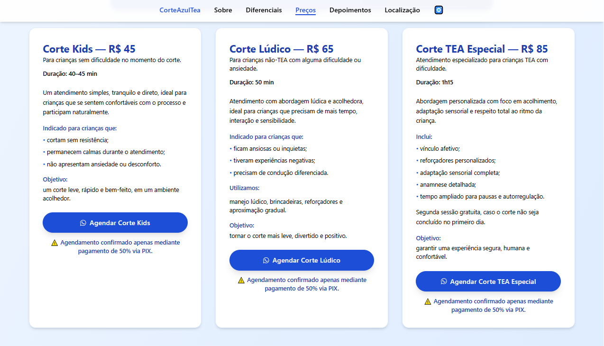
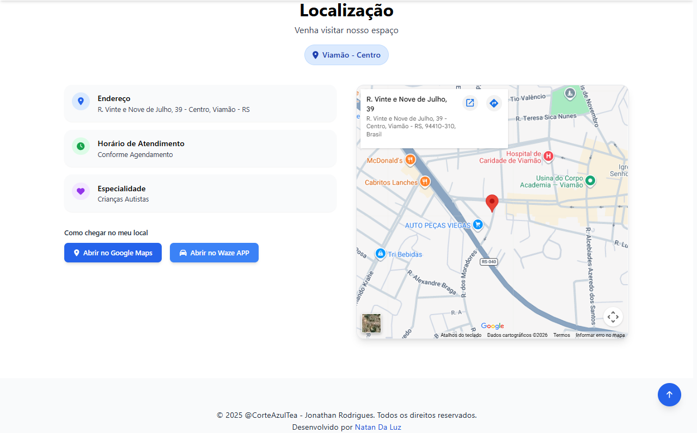

# CorteAzulTea — Website Institucional Responsivo

Aplicação web estática responsiva desenvolvida para o projeto **CorteAzulTea**, serviço de Jonathan Rodrigues especializado em cortes de cabelo para crianças com Transtorno do Espectro Autista (TEA), com foco em atendimento humanizado, ambiente acolhedor e comunicação clara com as famílias.


---

## 🎯 Proposta de Valor

Desenvolver uma interface web institucional acessível e informativa, capaz de comunicar com clareza os serviços oferecidos, reduzir barreiras de contato e transmitir confiança às famílias.

**Benefícios principais:**

- Comunicação clara sobre atendimento especializado (TEA)
- Interface responsiva com foco em usabilidade
- Facilitação de contato direto (WhatsApp e redes sociais)
- Apresentação estruturada de serviços, políticas e localização

---

## ⚙️ Funcionalidades

### Interface e UX

- Layout responsivo (mobile-first)
- Navegação por seções com rolagem suave
- Estrutura organizada e de fácil leitura
- Botão flutuante para contato rápido via WhatsApp

### Conteúdo Institucional

- Seção de serviços e valores
- Políticas de atendimento detalhadas
- Ficha de anamnese explicativa
- Informações sobre formas de pagamento

### Conteúdo Dinâmico

- Depoimentos carregados dinamicamente via JavaScript
- Seção de notícias e reportagem em vídeo
- Integração com mídias externas

### Localização e Contato

- Integração com Google Maps
- Rotas via Google Maps e Waze
- Links diretos para WhatsApp e Instagram

---

## 🏗️ Arquitetura / Estrutura

Separação entre estrutura, estilo e comportamento:

- **HTML** → estrutura semântica e conteúdo
- **CSS / Tailwind** → layout responsivo e estilização
- **JavaScript** → interatividade e carregamento dinâmico

**Estrutura do projeto:**

```bash
ProjetoCorteAzulTea/
├─ public/
│  ├─ index.html
│  ├─ manifest.json
│  └─ assets/
│     ├─ css/
│     │  └─ style.css
│     ├─ js/
│     │  ├─ script.js
│     │  └─ depoimentos.js
│     └─ img/
├─ tailwind.config.js
└─ README.md
```

---

## 🔐 Segurança

- Aplicação estática (sem backend)
- Ausência de manipulação de dados sensíveis
- Integrações externas controladas (maps e redes sociais)
- Baixa superfície de ataque

---

## 🧰 Stack Tecnológica

- HTML5 semântico
- CSS3
- Tailwind CSS (via CDN)
- JavaScript (Vanilla JS)
- Font Awesome
- Integrações com Google Maps e Waze

---

## 🚀 Instalação

### Pré-requisitos

- Navegador moderno (Chrome, Edge, Firefox)
- (Opcional) Git

### Passos

```bash
git clone https://github.com/NatanLuz/ProjetoCorteAzulTea.git
cd ProjetoCorteAzulTea/public
```

---

## ▶️ Execução

**Opção 1 — Python**

```bash
python -m http.server 8080
```

Acesse: http://localhost:8080

**Opção 2 — Live Server (VS Code)**

- Abrir `index.html`
- Clicar em **Open with Live Server**

---

## 🧪 Testes Rápidos

Checklist funcional:

- Validar navegação entre seções (desktop e mobile)
- Testar menu responsivo
- Verificar botão de WhatsApp
- Testar integração com Google Maps e Waze
- Reproduzir vídeos e conteúdos externos
- Validar responsividade em diferentes resoluções

---

## 📸 Screenshots

### Home


### Serviços



### Contato



---

## 👤 Autor

Natan Da Luz

📧 [natandaluz01@gmail.com](mailto:natandaluz01@gmail.com)


🔗 https://www.linkedin.com/in/natan-da-luz

---

## 📄 Licença

Este projeto está sob a licença **MIT**.
